# Course project

## Task:

Дана БД по пассажирским автобусным перевозкам в Тайланде [link](https://github.com/aeuge/postgres16book/tree/main/database)

Есть исходный запрос, который нужно оптимизировать

```postgresql
SELECT r.id,
       r.startdate                as depart_date,
       bs.city || ', ' || bs.name as busstation,
       count(t.id)                as order_place,
       count(st.id)               as all_place
FROM book.ride r
         JOIN book.schedule as s
              on r.fkschedule = s.id
         JOIN book.busroute br
              on s.fkroute = br.id
         JOIN book.busstation bs
              on br.fkbusstationfrom = bs.id
         JOIN book.tickets t
              on t.fkride = r.id
         JOIN book.seat st
              on r.fkbus = st.fkbus
GROUP BY r.id, r.startdate, bs.city || ', ' || bs.name
ORDER BY r.startdate
limit 10;
```

Для тестирования были развернуты 2 стенда:
* Docker based (Postgres 15.5), thai_small
* VM Ubuntu (Postgres 15.4), thai_medium

Схема БД:

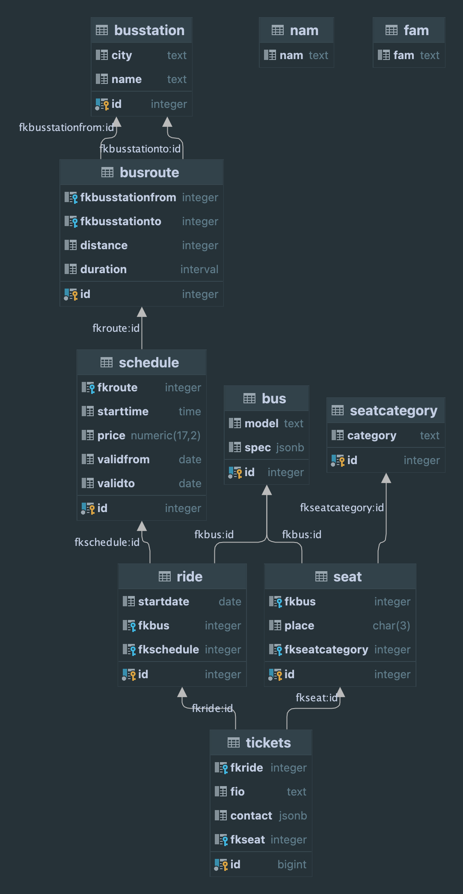

## Тестирование на локальном стенде

### Гипотеза: CTE

Вывод планировщика по исходному запросу

```sql
                                                                                                  QUERY PLAN                                                                                                  
--------------------------------------------------------------------------------------------------------------------------------------------------------------------------------------------------------------
Limit  (cost=12210030.61..12210030.64 rows=10 width=56) (actual time=84648.658..84648.723 rows=10 loops=1)
"  Output: r.id, r.startdate, (((bs.city || ', '::text) || bs.name)), (count(t.id)), (count(st.id))"
  ->  Sort  (cost=12210030.61..12213630.61 rows=1440000 width=56) (actual time=84276.018..84276.081 rows=10 loops=1)
"        Output: r.id, r.startdate, (((bs.city || ', '::text) || bs.name)), (count(t.id)), (count(st.id))"
        Sort Key: r.startdate
        Sort Method: top-N heapsort  Memory: 25kB
        ->  Finalize GroupAggregate  (cost=1610179.42..12178912.73 rows=1440000 width=56) (actual time=23197.992..84227.201 rows=144000 loops=1)
"              Output: r.id, r.startdate, (((bs.city || ', '::text) || bs.name)), count(t.id), count(st.id)"
"              Group Key: r.id, (((bs.city || ', '::text) || bs.name))"
              ->  Gather Merge  (cost=1610179.42..12128512.73 rows=2880000 width=56) (actual time=23197.699..84041.894 rows=432000 loops=1)
"                    Output: r.id, (((bs.city || ', '::text) || bs.name)), r.startdate, (PARTIAL count(t.id)), (PARTIAL count(st.id))"
                    Workers Planned: 2
                    Workers Launched: 2
                    ->  Partial GroupAggregate  (cost=1609179.39..11795089.25 rows=1440000 width=56) (actual time=22993.137..74774.224 rows=144000 loops=3)
"                          Output: r.id, (((bs.city || ', '::text) || bs.name)), r.startdate, PARTIAL count(t.id), PARTIAL count(st.id)"
"                          Group Key: r.id, (((bs.city || ', '::text) || bs.name))"
                          Worker 0:  actual time=22891.495..70398.674 rows=144000 loops=1
                            JIT:
                              Functions: 49
"                              Options: Inlining true, Optimization true, Expressions true, Deforming true"
"                              Timing: Generation 2.111 ms, Inlining 60.876 ms, Optimization 183.873 ms, Emission 120.854 ms, Total 367.715 ms"
                          Worker 1:  actual time=22898.968..70083.838 rows=144000 loops=1
                            JIT:
                              Functions: 49
"                              Options: Inlining true, Optimization true, Expressions true, Deforming true"
"                              Timing: Generation 2.065 ms, Inlining 59.918 ms, Optimization 184.899 ms, Emission 120.822 ms, Total 367.705 ms"
                          ->  Incremental Sort  (cost=1609179.39..10909238.90 rows=86425035 width=52) (actual time=22992.763..64775.967 rows=69140067 loops=3)
"                                Output: r.id, (((bs.city || ', '::text) || bs.name)), r.startdate, t.id, st.id"
"                                Sort Key: r.id, (((bs.city || ', '::text) || bs.name))"
                                Presorted Key: r.id
                                Full-sort Groups: 144000  Sort Method: quicksort  Average Memory: 30kB  Peak Memory: 30kB
                                Pre-sorted Groups: 144000  Sort Method: quicksort  Average Memory: 90kB  Peak Memory: 90kB
                                Worker 0:  actual time=22891.170..61291.503 rows=63953600 loops=1
                                  Full-sort Groups: 144000  Sort Method: quicksort  Average Memory: 30kB  Peak Memory: 30kB
                                  Pre-sorted Groups: 144000  Sort Method: quicksort  Average Memory: 61kB  Peak Memory: 62kB
                                Worker 1:  actual time=22898.571..60975.358 rows=62984920 loops=1
                                  Full-sort Groups: 144000  Sort Method: quicksort  Average Memory: 30kB  Peak Memory: 30kB
                                  Pre-sorted Groups: 144000  Sort Method: quicksort  Average Memory: 61kB  Peak Memory: 62kB
                                ->  Merge Join  (cost=1609123.24..3359189.15 rows=86425035 width=52) (actual time=22992.403..47895.726 rows=69140067 loops=3)
"                                      Output: r.id, ((bs.city || ', '::text) || bs.name), r.startdate, t.id, st.id"
                                      Merge Cond: (t.fkride = r.id)
                                      Worker 0:  actual time=22890.891..45676.339 rows=63953600 loops=1
                                      Worker 1:  actual time=22898.200..45520.916 rows=62984920 loops=1
                                      ->  Sort  (cost=381712.72..387114.28 rows=2160626 width=12) (actual time=3905.271..4187.444 rows=1728502 loops=3)
"                                            Output: t.id, t.fkride"
                                            Sort Key: t.fkride
                                            Sort Method: external merge  Disk: 43376kB
                                            Worker 0:  actual time=3802.107..4061.558 rows=1598840 loops=1
                                              Sort Method: external merge  Disk: 34496kB
                                            Worker 1:  actual time=3749.137..4008.021 rows=1574623 loops=1
                                              Sort Method: external merge  Disk: 33976kB
                                            ->  Parallel Seq Scan on book.tickets t  (cost=0.00..80532.26 rows=2160626 width=12) (actual time=283.274..587.265 rows=1728502 loops=3)
"                                                  Output: t.id, t.fkride"
                                                  Worker 0:  actual time=424.470..706.106 rows=1598840 loops=1
                                                  Worker 1:  actual time=425.264..708.999 rows=1574623 loops=1
                                      ->  Materialize  (cost=1227409.44..1256209.44 rows=5760000 width=76) (actual time=19087.067..24376.488 rows=69140055 loops=3)
"                                            Output: r.id, r.startdate, bs.city, bs.name, st.id"
                                            Worker 0:  actual time=19088.736..23985.630 rows=63953593 loops=1
                                            Worker 1:  actual time=19148.976..24010.078 rows=62984910 loops=1
                                            ->  Sort  (cost=1227409.44..1241809.44 rows=5760000 width=76) (actual time=19087.063..19858.291 rows=5760000 loops=3)
"                                                  Output: r.id, r.startdate, bs.city, bs.name, st.id"
                                                  Sort Key: r.id
                                                  Sort Method: external merge  Disk: 230376kB
                                                  Worker 0:  actual time=19088.732..19855.623 rows=5760000 loops=1
                                                    Sort Method: external merge  Disk: 230376kB
                                                  Worker 1:  actual time=19148.972..19916.437 rows=5760000 loops=1
                                                    Sort Method: external merge  Disk: 230376kB
                                                  ->  Hash Join  (cost=53.48..68754.49 rows=5760000 width=76) (actual time=1.293..590.070 rows=5760000 loops=3)
"                                                        Output: r.id, r.startdate, bs.city, bs.name, st.id"
                                                        Hash Cond: (r.fkbus = st.fkbus)
                                                        Worker 0:  actual time=1.278..587.725 rows=5760000 loops=1
                                                        Worker 1:  actual time=2.191..589.641 rows=5760000 loops=1
                                                        ->  Hash Join  (cost=46.98..3587.99 rows=144000 width=76) (actual time=0.934..101.339 rows=144000 loops=3)
"                                                              Output: r.id, r.startdate, r.fkbus, bs.city, bs.name"
                                                              Inner Unique: true
                                                              Hash Cond: (br.fkbusstationfrom = bs.id)
                                                              Worker 0:  actual time=0.985..103.590 rows=144000 loops=1
                                                              Worker 1:  actual time=1.482..103.266 rows=144000 loops=1
                                                              ->  Hash Join  (cost=45.75..3048.56 rows=144000 width=16) (actual time=0.776..76.738 rows=144000 loops=3)
"                                                                    Output: r.id, r.startdate, r.fkbus, br.fkbusstationfrom"
                                                                    Inner Unique: true
                                                                    Hash Cond: (s.fkroute = br.id)
                                                                    Worker 0:  actual time=0.819..79.357 rows=144000 loops=1
                                                                    Worker 1:  actual time=1.192..78.741 rows=144000 loops=1
                                                                    ->  Hash Join  (cost=43.40..2641.51 rows=144000 width=16) (actual time=0.608..52.831 rows=144000 loops=3)
"                                                                          Output: r.id, r.startdate, r.fkbus, s.fkroute"
                                                                          Inner Unique: true
                                                                          Hash Cond: (r.fkschedule = s.id)
                                                                          Worker 0:  actual time=0.632..55.225 rows=144000 loops=1
                                                                          Worker 1:  actual time=0.900..54.984 rows=144000 loops=1
                                                                          ->  Seq Scan on book.ride r  (cost=0.00..2219.00 rows=144000 width=16) (actual time=0.154..14.485 rows=144000 loops=3)
"                                                                                Output: r.id, r.startdate, r.fkbus, r.fkschedule"
                                                                                Worker 0:  actual time=0.175..14.686 rows=144000 loops=1
                                                                                Worker 1:  actual time=0.285..14.837 rows=144000 loops=1
                                                                          ->  Hash  (cost=25.40..25.40 rows=1440 width=8) (actual time=0.443..0.443 rows=1440 loops=3)
"                                                                                Output: s.id, s.fkroute"
                                                                                Buckets: 2048  Batches: 1  Memory Usage: 73kB
                                                                                Worker 0:  actual time=0.445..0.445 rows=1440 loops=1
                                                                                Worker 1:  actual time=0.602..0.603 rows=1440 loops=1
                                                                                ->  Seq Scan on book.schedule s  (cost=0.00..25.40 rows=1440 width=8) (actual time=0.161..0.273 rows=1440 loops=3)
"                                                                                      Output: s.id, s.fkroute"
                                                                                      Worker 0:  actual time=0.162..0.275 rows=1440 loops=1
                                                                                      Worker 1:  actual time=0.317..0.432 rows=1440 loops=1
                                                                    ->  Hash  (cost=1.60..1.60 rows=60 width=8) (actual time=0.160..0.161 rows=60 loops=3)
"                                                                          Output: br.id, br.fkbusstationfrom"
                                                                          Buckets: 1024  Batches: 1  Memory Usage: 11kB
                                                                          Worker 0:  actual time=0.179..0.179 rows=60 loops=1
                                                                          Worker 1:  actual time=0.283..0.284 rows=60 loops=1
                                                                          ->  Seq Scan on book.busroute br  (cost=0.00..1.60 rows=60 width=8) (actual time=0.146..0.151 rows=60 loops=3)
"                                                                                Output: br.id, br.fkbusstationfrom"
                                                                                Worker 0:  actual time=0.164..0.169 rows=60 loops=1
                                                                                Worker 1:  actual time=0.269..0.273 rows=60 loops=1
                                                              ->  Hash  (cost=1.10..1.10 rows=10 width=68) (actual time=0.149..0.150 rows=10 loops=3)
"                                                                    Output: bs.city, bs.name, bs.id"
                                                                    Buckets: 1024  Batches: 1  Memory Usage: 9kB
                                                                    Worker 0:  actual time=0.157..0.157 rows=10 loops=1
                                                                    Worker 1:  actual time=0.281..0.281 rows=10 loops=1
                                                                    ->  Seq Scan on book.busstation bs  (cost=0.00..1.10 rows=10 width=68) (actual time=0.144..0.145 rows=10 loops=3)
"                                                                          Output: bs.city, bs.name, bs.id"
                                                                          Worker 0:  actual time=0.150..0.152 rows=10 loops=1
                                                                          Worker 1:  actual time=0.275..0.276 rows=10 loops=1
                                                        ->  Hash  (cost=4.00..4.00 rows=200 width=8) (actual time=0.327..0.327 rows=200 loops=3)
"                                                              Output: st.id, st.fkbus"
                                                              Buckets: 1024  Batches: 1  Memory Usage: 16kB
                                                              Worker 0:  actual time=0.250..0.250 rows=200 loops=1
                                                              Worker 1:  actual time=0.663..0.664 rows=200 loops=1
                                                              ->  Seq Scan on book.seat st  (cost=0.00..4.00 rows=200 width=8) (actual time=0.284..0.299 rows=200 loops=3)
"                                                                    Output: st.id, st.fkbus"
                                                                    Worker 0:  actual time=0.208..0.223 rows=200 loops=1
                                                                    Worker 1:  actual time=0.620..0.636 rows=200 loops=1
Planning Time: 1.440 ms
JIT:
  Functions: 151
"  Options: Inlining true, Optimization true, Expressions true, Deforming true"
"  Timing: Generation 8.280 ms, Inlining 135.412 ms, Optimization 590.232 ms, Emission 378.346 ms, Total 1112.271 ms"
Execution Time: 84683.808 ms
```

Можно заметить, что в исходном запросе неверно считается кол-во мест в автобусе и проданных билетов.

Для оптимизации запроса было принято решение вынести редко изменяемые данные в материализованные представления.

```postgresql
create materialized view if not exists book.busstation_material as
(
select bs.id, bs.city || ', ' || bs.name as busstation
from book.busstation bs);
create unique index on book.busstation_material (id);
```

```postgresql
create materialized view if not exists book.bus_capacity as
(
select b.id, count(s.id) as capacity
from book.bus b
         join book.seat s on b.id = s.fkbus
group by b.id);
create unique index on book.bus_capacity (id);
```

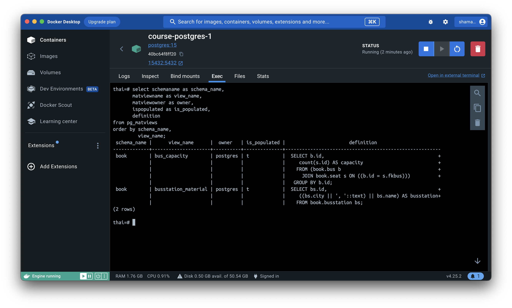

Сам запрос было решено оптимизировать при помощи CTE.

```postgresql
with busstation as
         (select sch.id, bs.busstation
          from book.schedule sch
                   JOIN book.busroute br
                        on br.id = sch.fkroute
                   JOIN book.busstation_material bs
                        on bs.id = br.fkbusstationfrom),
     total_seats as
         (select r.id, bc.capacity total_seats
          from book.ride r
                   join book.bus_capacity bc on bc.id = r.fkbus),
     bought_seats as
         (select r.id, r.startdate, count(t.id) as bought_seats
          from book.ride r
                   left join book.tickets t on r.id = t.fkride
          group by r.id, r.startdate)
select r.id, r.startdate, bst.busstation, ts.total_seats, bs.bought_seats
from book.ride r
         left join busstation bst on r.fkschedule = bst.id
         left join total_seats ts on r.id = ts.id
         left join bought_seats bs on r.id = bs.id
order by r.startdate, r.id;
```

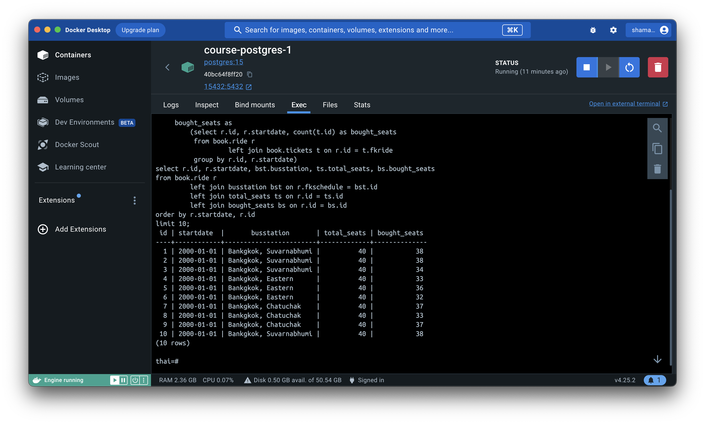

Также для оптимизации работы с памятью был увеличен параметр _work_mem_.
```postgresql
set work_mem to '64MB';
```

Вывод планировщика по оптимизированному запросу.

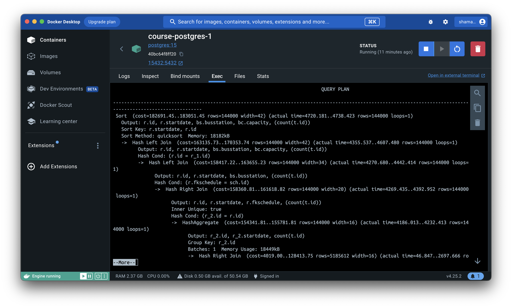

```sql
                                                                                                  QUERY PLAN                                                                                                  
--------------------------------------------------------------------------------------------------------------------------------------------------------------------------------------------------------------
Sort  (cost=182688.75..183048.75 rows=144000 width=42) (actual time=4350.298..4367.626 rows=144000 loops=1)
"  Output: r.id, r.startdate, bs.busstation, bc.capacity, (count(t.id))"
"  Sort Key: r.startdate, r.id"
  Sort Method: quicksort  Memory: 18182kB
  ->  Hash Left Join  (cost=163133.03..170351.04 rows=144000 width=42) (actual time=4044.005..4255.397 rows=144000 loops=1)
"        Output: r.id, r.startdate, bs.busstation, bc.capacity, (count(t.id))"
        Hash Cond: (r.id = r_1.id)
        ->  Hash Left Join  (cost=158414.52..163652.53 rows=144000 width=34) (actual time=3967.238..4110.327 rows=144000 loops=1)
"              Output: r.id, r.startdate, bs.busstation, (count(t.id))"
              Hash Cond: (r.fkschedule = sch.id)
              ->  Hash Right Join  (cost=158358.12..161616.13 rows=144000 width=20) (actual time=3965.498..4068.420 rows=144000 loops=1)
"                    Output: r.id, r.startdate, r.fkschedule, (count(t.id))"
                    Inner Unique: true
                    Hash Cond: (r_2.id = r.id)
                    ->  HashAggregate  (cost=154339.12..155779.12 rows=144000 width=16) (actual time=3885.154..3921.885 rows=144000 loops=1)
"                          Output: r_2.id, r_2.startdate, count(t.id)"
                          Group Key: r_2.id
                          Batches: 1  Memory Usage: 18449kB
                          ->  Hash Right Join  (cost=4019.00..128411.82 rows=5185459 width=16) (actual time=47.168..2502.966 rows=5185505 loops=1)
"                                Output: r_2.id, r_2.startdate, t.id"
                                Inner Unique: true
                                Hash Cond: (t.fkride = r_2.id)
                                ->  Seq Scan on book.tickets t  (cost=0.00..110780.59 rows=5185459 width=12) (actual time=0.027..596.796 rows=5185505 loops=1)
"                                      Output: t.id, t.fkride, t.fio, t.contact, t.fkseat"
                                ->  Hash  (cost=2219.00..2219.00 rows=144000 width=8) (actual time=46.261..46.262 rows=144000 loops=1)
"                                      Output: r_2.id, r_2.startdate"
                                      Buckets: 262144  Batches: 1  Memory Usage: 7673kB
                                      ->  Seq Scan on book.ride r_2  (cost=0.00..2219.00 rows=144000 width=8) (actual time=0.030..16.314 rows=144000 loops=1)
"                                            Output: r_2.id, r_2.startdate"
                    ->  Hash  (cost=2219.00..2219.00 rows=144000 width=12) (actual time=80.218..80.219 rows=144000 loops=1)
"                          Output: r.id, r.startdate, r.fkschedule"
                          Buckets: 262144  Batches: 1  Memory Usage: 8236kB
                          ->  Seq Scan on book.ride r  (cost=0.00..2219.00 rows=144000 width=12) (actual time=28.298..45.919 rows=144000 loops=1)
"                                Output: r.id, r.startdate, r.fkschedule"
              ->  Hash  (cost=38.40..38.40 rows=1440 width=22) (actual time=1.704..1.707 rows=1440 loops=1)
"                    Output: sch.id, bs.busstation"
                    Buckets: 2048  Batches: 1  Memory Usage: 93kB
                    ->  Hash Join  (cost=3.58..38.40 rows=1440 width=22) (actual time=0.077..1.249 rows=1440 loops=1)
"                          Output: sch.id, bs.busstation"
                          Inner Unique: true
                          Hash Cond: (br.fkbusstationfrom = bs.id)
                          ->  Hash Join  (cost=2.35..31.80 rows=1440 width=8) (actual time=0.040..0.808 rows=1440 loops=1)
"                                Output: sch.id, br.fkbusstationfrom"
                                Inner Unique: true
                                Hash Cond: (sch.fkroute = br.id)
                                ->  Seq Scan on book.schedule sch  (cost=0.00..25.40 rows=1440 width=8) (actual time=0.003..0.171 rows=1440 loops=1)
"                                      Output: sch.id, sch.fkroute, sch.starttime, sch.price, sch.validfrom, sch.validto"
                                ->  Hash  (cost=1.60..1.60 rows=60 width=8) (actual time=0.027..0.027 rows=60 loops=1)
"                                      Output: br.id, br.fkbusstationfrom"
                                      Buckets: 1024  Batches: 1  Memory Usage: 11kB
                                      ->  Seq Scan on book.busroute br  (cost=0.00..1.60 rows=60 width=8) (actual time=0.007..0.013 rows=60 loops=1)
"                                            Output: br.id, br.fkbusstationfrom"
                          ->  Hash  (cost=1.10..1.10 rows=10 width=22) (actual time=0.029..0.029 rows=10 loops=1)
"                                Output: bs.busstation, bs.id"
                                Buckets: 1024  Batches: 1  Memory Usage: 9kB
                                ->  Seq Scan on book.busstation_material bs  (cost=0.00..1.10 rows=10 width=22) (actual time=0.013..0.015 rows=10 loops=1)
"                                      Output: bs.busstation, bs.id"
        ->  Hash  (cost=2918.51..2918.51 rows=144000 width=12) (actual time=76.488..76.490 rows=144000 loops=1)
"              Output: r_1.id, bc.capacity"
              Buckets: 262144  Batches: 1  Memory Usage: 8798kB
              ->  Hash Join  (cost=1.11..2918.51 rows=144000 width=12) (actual time=0.071..45.493 rows=144000 loops=1)
"                    Output: r_1.id, bc.capacity"
                    Inner Unique: true
                    Hash Cond: (r_1.fkbus = bc.id)
                    ->  Seq Scan on book.ride r_1  (cost=0.00..2219.00 rows=144000 width=8) (actual time=0.011..11.485 rows=144000 loops=1)
"                          Output: r_1.id, r_1.startdate, r_1.fkbus, r_1.fkschedule"
                    ->  Hash  (cost=1.05..1.05 rows=5 width=12) (actual time=0.036..0.037 rows=5 loops=1)
"                          Output: bc.capacity, bc.id"
                          Buckets: 1024  Batches: 1  Memory Usage: 9kB
                          ->  Seq Scan on book.bus_capacity bc  (cost=0.00..1.05 rows=5 width=12) (actual time=0.020..0.022 rows=5 loops=1)
"                                Output: bc.capacity, bc.id"
Planning Time: 0.645 ms
JIT:
  Functions: 66
"  Options: Inlining false, Optimization false, Expressions true, Deforming true"
"  Timing: Generation 1.888 ms, Inlining 0.000 ms, Optimization 0.958 ms, Emission 27.539 ms, Total 30.385 ms"
Execution Time: 4378.474 ms
```

По сравнению с исходным запросом получаем прирост в скорости в 19.34 раз.

### Гипотеза: columnar storage

Для тестирования на локальном стенде было принято решение использовать готовый образ
[citus](https://hub.docker.com/r/citusdata/citus).

Развернув образ, добавляем необходимое нам расширение.

```postgresql
CREATE EXTENSION IF NOT EXISTS citus;
\dx
```

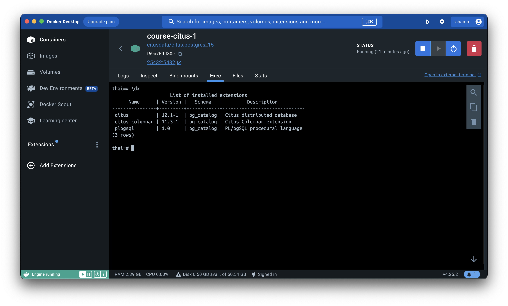

| Name           | Version | Schema     | Description                  |
|----------------|---------|------------|------------------------------|
| citus          | 12.1-1  | pg_catalog | Citus distributed database   |
| citus_columnar | 11.3-1  | pg_catalog | Citus Columnar extension     |
| plpgsql        | 1.0     | pg_catalog | PL/pgSQL procedural language |

Для сравнения с предыдущей гипотезой был установлен идентичный параметр _work_mem_.
```postgresql
set work_mem to '64MB';
```

По аналогии с гипотезой CTE выделяем редко используемые данные в материализованные представления.

```postgresql
create materialized view if not exists book.busstation_material as
(
select bs.id, bs.city || ', ' || bs.name as busstation
from book.busstation bs);
create unique index on book.busstation_material (id);
```

```postgresql
create materialized view if not exists book.bus_capacity as
(
select b.id, count(s.id) as capacity
from book.bus b
         join book.seat s on b.id = s.fkbus
group by b.id);
create unique index on book.bus_capacity (id);
```


Известно, что таблицы с колоночным типом хранения более эффективны на больших наборах данных, поэтому выделяем самые
объемные таблицы и создаем на их основе колоночные.

```postgresql
create table book.tickets_row (like book.tickets) using columnar;
create table book.ride_row (like book.ride) using columnar;
```

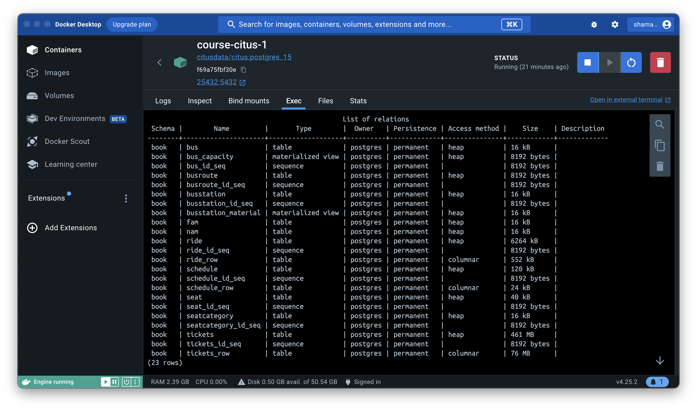

Исследовав запросы в предыдущей гипотезе, выделяем запрос на подсчет купленных билетов во временную таблицу с колоночным
хранением на основе созданных выше таблиц.

```postgresql
create temporary table bought_seats using columnar as
select r.id, r.startdate, count(t.id) as bought_seats
from book.ride_row r
         left join book.tickets_row t on r.id = t.fkride
group by r.id, r.startdate;
```

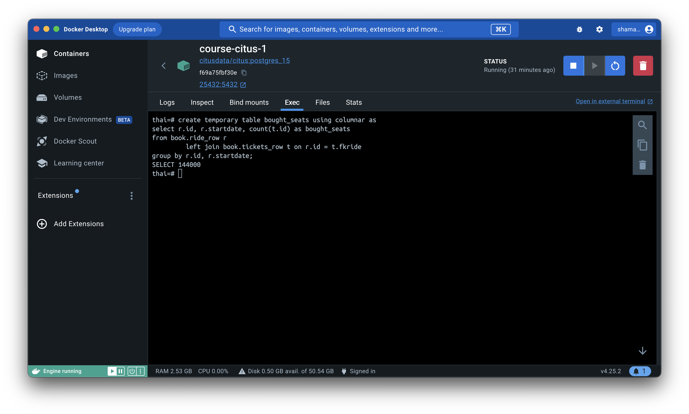

Получается достаточно тяжелый запрос, но эта временная таблица может пригодиться для других запросов, выходящих за рамки
данного курсового проекта.

```sql
                                                                                                  QUERY PLAN                                                                                                  
--------------------------------------------------------------------------------------------------------------------------------------------------------------------------------------------------------------
HashAggregate  (cost=115888.65..117328.65 rows=144000 width=16) (actual time=5698.359..5738.275 rows=144000 loops=1)
"  Output: r.id, r.startdate, count(t.id)"
"  Group Key: r.id, r.startdate"
  Batches: 1  Memory Usage: 18449kB
  ->  Hash Right Join  (cost=1832.99..76997.37 rows=5185505 width=16) (actual time=91.895..3881.759 rows=5185505 loops=1)
"        Output: r.id, r.startdate, t.id"
        Hash Cond: (t.fkride = r.id)
        ->  Custom Scan (ColumnarScan) on book.tickets_row t  (cost=0.00..3863.69 rows=5185505 width=12) (actual time=1.235..1286.039 rows=5185505 loops=1)
"              Output: t.id, t.fkride"
"              Columnar Projected Columns: id, fkride"
        ->  Hash  (cost=32.99..32.99 rows=144000 width=8) (actual time=88.928..88.929 rows=144000 loops=1)
"              Output: r.id, r.startdate"
              Buckets: 262144  Batches: 1  Memory Usage: 7673kB
              ->  Custom Scan (ColumnarScan) on book.ride_row r  (cost=0.00..32.99 rows=144000 width=8) (actual time=11.431..43.515 rows=144000 loops=1)
"                    Output: r.id, r.startdate"
"                    Columnar Projected Columns: id, startdate"
Planning Time: 3.389 ms
JIT:
  Functions: 13
"  Options: Inlining false, Optimization false, Expressions true, Deforming true"
"  Timing: Generation 0.847 ms, Inlining 0.000 ms, Optimization 0.569 ms, Emission 8.771 ms, Total 10.188 ms"
Execution Time: 5856.030 ms
```

Результирующий запрос похож на запрос из предыдущей гипотезы, но он выполняется ощутимо быстрее.

```postgresql
with busstation as
         (select sch.id, bs.busstation
          from book.schedule sch
                   join book.busroute br
                        on br.id = sch.fkroute
                   join book.busstation_material bs
                        on bs.id = br.fkbusstationfrom)
select r.id, r.startdate, bst.busstation, bc.capacity total_seats, bs.bought_seats
from book.ride r
         left join busstation bst on r.fkschedule = bst.id
         left join bought_seats bs on r.id = bs.id
         left join book.bus_capacity bc on bc.id = r.fkbus
order by r.startdate, r.id;
```

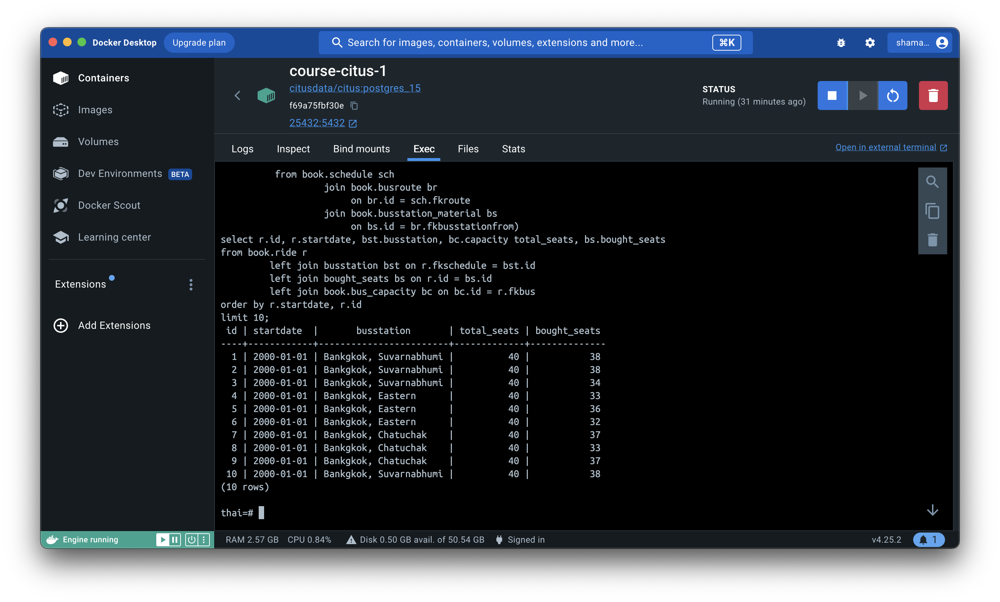

Вывод планировщика по оптимизированному запросу.

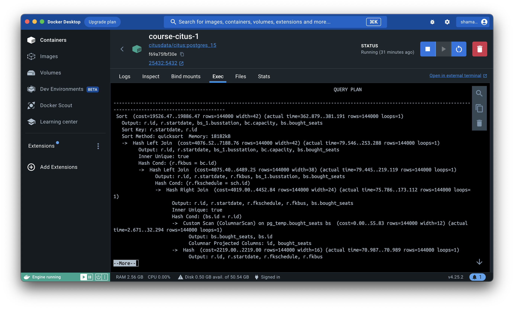

```sql
                                                                                                  QUERY PLAN                                                                                                  
--------------------------------------------------------------------------------------------------------------------------------------------------------------------------------------------------------------
Sort  (cost=19526.47..19886.47 rows=144000 width=42) (actual time=335.936..355.387 rows=144000 loops=1)
"  Output: r.id, r.startdate, bs_1.busstation, bc.capacity, bs.bought_seats"
"  Sort Key: r.startdate, r.id"
  Sort Method: quicksort  Memory: 18182kB
  ->  Hash Left Join  (cost=4076.52..7188.76 rows=144000 width=42) (actual time=60.144..243.064 rows=144000 loops=1)
"        Output: r.id, r.startdate, bs_1.busstation, bc.capacity, bs.bought_seats"
        Inner Unique: true
        Hash Cond: (r.fkbus = bc.id)
        ->  Hash Left Join  (cost=4075.40..6489.25 rows=144000 width=38) (actual time=60.130..207.125 rows=144000 loops=1)
"              Output: r.id, r.startdate, r.fkbus, bs_1.busstation, bs.bought_seats"
              Hash Cond: (r.fkschedule = sch.id)
              ->  Hash Right Join  (cost=4019.00..4452.84 rows=144000 width=24) (actual time=58.788..159.518 rows=144000 loops=1)
"                    Output: r.id, r.startdate, r.fkschedule, r.fkbus, bs.bought_seats"
                    Inner Unique: true
                    Hash Cond: (bs.id = r.id)
                    ->  Custom Scan (ColumnarScan) on pg_temp.bought_seats bs  (cost=0.00..55.83 rows=144000 width=12) (actual time=0.629..32.702 rows=144000 loops=1)
"                          Output: bs.bought_seats, bs.id"
"                          Columnar Projected Columns: id, bought_seats"
                    ->  Hash  (cost=2219.00..2219.00 rows=144000 width=16) (actual time=58.064..58.066 rows=144000 loops=1)
"                          Output: r.id, r.startdate, r.fkschedule, r.fkbus"
                          Buckets: 262144  Batches: 1  Memory Usage: 8798kB
                          ->  Seq Scan on book.ride r  (cost=0.00..2219.00 rows=144000 width=16) (actual time=0.007..23.790 rows=144000 loops=1)
"                                Output: r.id, r.startdate, r.fkschedule, r.fkbus"
              ->  Hash  (cost=38.40..38.40 rows=1440 width=22) (actual time=1.334..1.338 rows=1440 loops=1)
"                    Output: sch.id, bs_1.busstation"
                    Buckets: 2048  Batches: 1  Memory Usage: 93kB
                    ->  Hash Join  (cost=3.58..38.40 rows=1440 width=22) (actual time=0.038..1.045 rows=1440 loops=1)
"                          Output: sch.id, bs_1.busstation"
                          Inner Unique: true
                          Hash Cond: (br.fkbusstationfrom = bs_1.id)
                          ->  Hash Join  (cost=2.35..31.80 rows=1440 width=8) (actual time=0.025..0.696 rows=1440 loops=1)
"                                Output: sch.id, br.fkbusstationfrom"
                                Inner Unique: true
                                Hash Cond: (sch.fkroute = br.id)
                                ->  Seq Scan on book.schedule sch  (cost=0.00..25.40 rows=1440 width=8) (actual time=0.003..0.197 rows=1440 loops=1)
"                                      Output: sch.id, sch.fkroute, sch.starttime, sch.price, sch.validfrom, sch.validto"
                                ->  Hash  (cost=1.60..1.60 rows=60 width=8) (actual time=0.018..0.019 rows=60 loops=1)
"                                      Output: br.id, br.fkbusstationfrom"
                                      Buckets: 1024  Batches: 1  Memory Usage: 11kB
                                      ->  Seq Scan on book.busroute br  (cost=0.00..1.60 rows=60 width=8) (actual time=0.004..0.010 rows=60 loops=1)
"                                            Output: br.id, br.fkbusstationfrom"
                          ->  Hash  (cost=1.10..1.10 rows=10 width=22) (actual time=0.011..0.011 rows=10 loops=1)
"                                Output: bs_1.busstation, bs_1.id"
                                Buckets: 1024  Batches: 1  Memory Usage: 9kB
                                ->  Seq Scan on book.busstation_material bs_1  (cost=0.00..1.10 rows=10 width=22) (actual time=0.006..0.008 rows=10 loops=1)
"                                      Output: bs_1.busstation, bs_1.id"
        ->  Hash  (cost=1.05..1.05 rows=5 width=12) (actual time=0.009..0.009 rows=5 loops=1)
"              Output: bc.capacity, bc.id"
              Buckets: 1024  Batches: 1  Memory Usage: 9kB
              ->  Seq Scan on book.bus_capacity bc  (cost=0.00..1.05 rows=5 width=12) (actual time=0.006..0.007 rows=5 loops=1)
"                    Output: bc.capacity, bc.id"
Planning Time: 0.711 ms
Execution Time: 362.676 ms
```

По сравнению с исходным запросом получаем прирост в скорости в 13.62 раза, учитывая создания временной таблицы.
Если брать "чистое" время выполнения запроса, то прирост в 233.5 раз.

## Тестирование на локальном стенде

### Гипотеза: CTE

Вывод планировщика по исходному запросу

```sql
                                                                                                  QUERY PLAN                                                                                                  
--------------------------------------------------------------------------------------------------------------------------------------------------------------------------------------------------------------
 Limit  (cost=79614410.59..79614410.62 rows=10 width=56) (actual time=1530240.310..1530240.441 rows=10 loops=1)
   Output: r.id, r.startdate, (((bs.city || ', '::text) || bs.name)), (count(t.id)), (count(st.id))
   ->  Sort  (cost=79614410.59..79651910.59 rows=15000000 width=56) (actual time=1529946.246..1529946.375 rows=10 loops=1)
         Output: r.id, r.startdate, (((bs.city || ', '::text) || bs.name)), (count(t.id)), (count(st.id))
         Sort Key: r.startdate
         Sort Method: top-N heapsort  Memory: 25kB
         ->  GroupAggregate  (cost=9171240.44..79290265.98 rows=15000000 width=56) (actual time=853192.285..1529665.420 rows=1500000 loops=1)
               Output: r.id, r.startdate, (((bs.city || ', '::text) || bs.name)), count(t.id), count(st.id)
               Group Key: r.id, ((bs.city || ', '::text) || bs.name)
               ->  Merge Join  (cost=9171240.44..57466275.26 rows=2159899072 width=52) (actual time=853191.674..1364636.014 rows=2159899000 loops=1)
                     Output: r.id, ((bs.city || ', '::text) || bs.name), r.startdate, t.id, st.id
                     Merge Cond: (r.id = t.fkride)
                     ->  Nested Loop  (cost=1655.91..4813715.54 rows=60000001 width=76) (actual time=469.948..30050.831 rows=60000000 loops=1)
                           Output: r.id, r.startdate, bs.city, bs.name, st.id
                           Join Filter: (r.fkbus = st.fkbus)
                           Rows Removed by Join Filter: 240000000
                           ->  Gather Merge  (cost=1655.91..313711.04 rows=1500000 width=76) (actual time=469.861..1378.433 rows=1500000 loops=1)
                                 Output: r.id, r.startdate, r.fkbus, bs.city, bs.name
                                 Workers Planned: 2
                                 Workers Launched: 2
                                 ->  Incremental Sort  (cost=655.89..139573.80 rows=625000 width=76) (actual time=286.852..1899.034 rows=500000 loops=3)
                                       Output: r.id, r.startdate, r.fkbus, bs.city, bs.name, (((bs.city || ', '::text) || bs.name))
                                       Sort Key: r.id, (((bs.city || ', '::text) || bs.name))
                                       Presorted Key: r.id
                                       Full-sort Groups: 6874  Sort Method: quicksort  Average Memory: 27kB  Peak Memory: 27kB
                                       Worker 0:  actual time=424.929..2583.511 rows=639768 loops=1
                                         Full-sort Groups: 19993  Sort Method: quicksort  Average Memory: 27kB  Peak Memory: 27kB
                                         JIT:
                                           Functions: 31
                                           Options: Inlining true, Optimization true, Expressions true, Deforming true
                                           Timing: Generation 2.237 ms, Inlining 135.460 ms, Optimization 176.843 ms, Emission 95.224 ms, Total 409.765 ms
                                       Worker 1:  actual time=389.119..2573.734 rows=640266 loops=1
                                         Full-sort Groups: 20009  Sort Method: quicksort  Average Memory: 27kB  Peak Memory: 27kB
                                         JIT:
                                           Functions: 31
                                           Options: Inlining true, Optimization true, Expressions true, Deforming true
                                           Timing: Generation 2.222 ms, Inlining 117.230 ms, Optimization 157.649 ms, Emission 103.073 ms, Total 380.174 ms
                                       ->  Nested Loop  (cost=1.01..73813.85 rows=625000 width=76) (actual time=286.476..1652.001 rows=500000 loops=3)
                                             Output: r.id, r.startdate, r.fkbus, bs.city, bs.name, ((bs.city || ', '::text) || bs.name)
                                             Inner Unique: true
                                             Worker 0:  actual time=424.594..2250.536 rows=639768 loops=1
                                             Worker 1:  actual time=388.628..2238.099 rows=640266 loops=1
                                             ->  Nested Loop  (cost=0.87..58953.67 rows=625000 width=16) (actual time=281.178..1295.428 rows=500000 loops=3)
                                                   Output: r.id, r.startdate, r.fkbus, br.fkbusstationfrom
                                                   Inner Unique: true
                                                   Worker 0:  actual time=424.558..1772.567 rows=639768 loops=1
                                                   Worker 1:  actual time=388.585..1759.616 rows=640266 loops=1
                                                   ->  Nested Loop  (cost=0.72..43470.09 rows=625000 width=16) (actual time=281.127..1010.967 rows=500000 loops=3)
                                                         Output: r.id, r.startdate, r.fkbus, s.fkroute
                                                         Inner Unique: true
                                                         Worker 0:  actual time=424.507..1384.446 rows=639768 loops=1
                                                         Worker 1:  actual time=388.517..1374.967 rows=640266 loops=1
                                                         ->  Parallel Index Scan using ride_pkey on book.ride r  (cost=0.43..26387.13 rows=625000 width=16) (actual time=10.158..376.511 rows=500000 loops=3)
                                                               Output: r.id, r.startdate, r.fkbus, r.fkschedule
                                                               Worker 0:  actual time=0.069..476.643 rows=639768 loops=1
                                                               Worker 1:  actual time=0.133..496.490 rows=640266 loops=1
                                                         ->  Memoize  (cost=0.29..0.99 rows=1 width=8) (actual time=0.001..0.001 rows=1 loops=1500000)
                                                               Output: s.id, s.fkroute
                                                               Cache Key: r.fkschedule
                                                               Cache Mode: logical
                                                               Hits: 218466  Misses: 1500  Evictions: 0  Overflows: 0  Memory Usage: 159kB
                                                               Worker 0:  actual time=0.001..0.001 rows=1 loops=639768
                                                                 Hits: 638268  Misses: 1500  Evictions: 0  Overflows: 0  Memory Usage: 159kB
                                                               Worker 1:  actual time=0.001..0.001 rows=1 loops=640266
                                                                 Hits: 638766  Misses: 1500  Evictions: 0  Overflows: 0  Memory Usage: 159kB
                                                               ->  Index Scan using schedule_pkey on book.schedule s  (cost=0.28..0.98 rows=1 width=8) (actual time=0.010..0.010 rows=1 loops=4500)
                                                                     Output: s.id, s.fkroute
                                                                     Index Cond: (s.id = r.fkschedule)
                                                                     Worker 0:  actual time=0.013..0.013 rows=1 loops=1500
                                                                     Worker 1:  actual time=0.014..0.014 rows=1 loops=1500
                                                   ->  Memoize  (cost=0.15..0.17 rows=1 width=8) (actual time=0.000..0.000 rows=1 loops=1500000)
                                                         Output: br.id, br.fkbusstationfrom
                                                         Cache Key: s.fkroute
                                                         Cache Mode: logical
                                                         Hits: 219906  Misses: 60  Evictions: 0  Overflows: 0  Memory Usage: 7kB
                                                         Worker 0:  actual time=0.000..0.000 rows=1 loops=639768
                                                           Hits: 639708  Misses: 60  Evictions: 0  Overflows: 0  Memory Usage: 7kB
                                                         Worker 1:  actual time=0.000..0.000 rows=1 loops=640266
                                                           Hits: 640206  Misses: 60  Evictions: 0  Overflows: 0  Memory Usage: 7kB
                                                         ->  Index Scan using busroute_pkey on book.busroute br  (cost=0.14..0.16 rows=1 width=8) (actual time=0.002..0.002 rows=1 loops=180)
                                                               Output: br.id, br.fkbusstationfrom
                                                               Index Cond: (br.id = s.fkroute)
                                                               Worker 0:  actual time=0.001..0.001 rows=1 loops=60
                                                               Worker 1:  actual time=0.002..0.002 rows=1 loops=60
                                             ->  Memoize  (cost=0.15..0.22 rows=1 width=68) (actual time=0.000..0.000 rows=1 loops=1500000)
                                                   Output: bs.city, bs.name, bs.id
                                                   Cache Key: br.fkbusstationfrom
                                                   Cache Mode: logical
                                                   Hits: 219956  Misses: 10  Evictions: 0  Overflows: 0  Memory Usage: 2kB
                                                   Worker 0:  actual time=0.000..0.000 rows=1 loops=639768
                                                     Hits: 639758  Misses: 10  Evictions: 0  Overflows: 0  Memory Usage: 2kB
                                                   Worker 1:  actual time=0.000..0.000 rows=1 loops=640266
                                                     Hits: 640256  Misses: 10  Evictions: 0  Overflows: 0  Memory Usage: 2kB
                                                   ->  Index Scan using busstation_pkey on book.busstation bs  (cost=0.14..0.21 rows=1 width=68) (actual time=0.529..0.529 rows=1 loops=30)
                                                         Output: bs.city, bs.name, bs.id
                                                         Index Cond: (bs.id = br.fkbusstationfrom)
                                                         Worker 0:  actual time=0.003..0.003 rows=1 loops=10
                                                         Worker 1:  actual time=0.004..0.004 rows=1 loops=10
                           ->  Materialize  (cost=0.00..5.00 rows=200 width=8) (actual time=0.000..0.008 rows=200 loops=1500000)
                                 Output: st.id, st.fkbus
                                 ->  Seq Scan on book.seat st  (cost=0.00..4.00 rows=200 width=8) (actual time=0.023..0.073 rows=200 loops=1)
                                       Output: st.id, st.fkbus
                     ->  Materialize  (cost=9169584.53..9439571.91 rows=53997476 width=12) (actual time=852721.553..958350.764 rows=2159898961 loops=1)
                           Output: t.id, t.fkride
                           ->  Sort  (cost=9169584.53..9304578.22 rows=53997476 width=12) (actual time=852721.541..864062.808 rows=53997475 loops=1)
                                 Output: t.id, t.fkride
                                 Sort Key: t.fkride
                                 Sort Method: external merge  Disk: 1162568kB
                                 ->  Seq Scan on book.tickets t  (cost=0.00..1153577.76 rows=53997476 width=12) (actual time=0.013..654503.437 rows=53997475 loops=1)
                                       Output: t.id, t.fkride
 Planning Time: 1.151 ms
 JIT:
   Functions: 111
   Options: Inlining true, Optimization true, Expressions true, Deforming true
   Timing: Generation 6.298 ms, Inlining 269.520 ms, Optimization 500.818 ms, Emission 309.455 ms, Total 1086.091 ms
 Execution Time: 1530414.168 ms
(116 rows)
```

На этом стенде сначала протестируем запрос, сформированный для локальной машины.

```sql
                                                                              QUERY PLAN                                                                              
----------------------------------------------------------------------------------------------------------------------------------------------------------------------
 Sort  (cost=1929156.81..1932906.81 rows=1500000 width=42) (actual time=344623.232..344845.964 rows=1500000 loops=1)
   Output: r.id, r.startdate, bs.busstation, bc.capacity, (count(t.id))
   Sort Key: r.startdate, r.id
   Sort Method: quicksort  Memory: 174543kB
   Buffers: shared hit=24662 read=613283
   ->  Hash Left Join  (cost=1698220.32..1775282.83 rows=1500000 width=42) (actual time=341204.927..343554.383 rows=1500000 loops=1)
         Output: r.id, r.startdate, bs.busstation, bc.capacity, (count(t.id))
         Hash Cond: (r.id = r_1.id)
         Buffers: shared hit=24662 read=613283
         ->  Hash Left Join  (cost=1649085.20..1703647.72 rows=1500000 width=34) (actual time=340472.275..342026.439 rows=1500000 loops=1)
               Output: r.id, r.startdate, bs.busstation, (count(t.id))
               Hash Cond: (r.fkschedule = sch.id)
               Buffers: shared hit=16552 read=613283
               ->  Hash Right Join  (cost=1649026.06..1682963.57 rows=1500000 width=20) (actual time=340471.296..341741.476 rows=1500000 loops=1)
                     Output: r.id, r.startdate, r.fkschedule, (count(t.id))
                     Inner Unique: true
                     Hash Cond: (r_2.id = r.id)
                     Buffers: shared hit=16538 read=613283
                     ->  HashAggregate  (cost=1607167.06..1622167.06 rows=1500000 width=16) (actual time=339586.114..340059.743 rows=1500000 loops=1)
                           Output: r_2.id, r_2.startdate, count(t.id)
                           Group Key: r_2.id
                           Batches: 1  Memory Usage: 172049kB
                           Buffers: shared hit=8429 read=613283
                           ->  Hash Right Join  (cost=41859.00..1337179.92 rows=53997428 width=16) (actual time=511.184..319717.678 rows=53997475 loops=1)
                                 Output: r_2.id, r_2.startdate, t.id
                                 Inner Unique: true
                                 Hash Cond: (t.fkride = r_2.id)
                                 Buffers: shared hit=8429 read=613283
                                 ->  Seq Scan on book.tickets t  (cost=0.00..1153577.28 rows=53997428 width=12) (actual time=1.396..294907.746 rows=53997475 loops=1)
                                       Output: t.id, t.fkride, t.fio, t.contact, t.fkseat
                                       Buffers: shared hit=320 read=613283
                                 ->  Hash  (cost=23109.00..23109.00 rows=1500000 width=8) (actual time=498.960..498.963 rows=1500000 loops=1)
                                       Output: r_2.id, r_2.startdate
                                       Buckets: 2097152  Batches: 1  Memory Usage: 74978kB
                                       Buffers: shared hit=8109
                                       ->  Seq Scan on book.ride r_2  (cost=0.00..23109.00 rows=1500000 width=8) (actual time=0.041..134.750 rows=1500000 loops=1)
                                             Output: r_2.id, r_2.startdate
                                             Buffers: shared hit=8109
                     ->  Hash  (cost=23109.00..23109.00 rows=1500000 width=12) (actual time=874.458..874.459 rows=1500000 loops=1)
                           Output: r.id, r.startdate, r.fkschedule
                           Buckets: 2097152  Batches: 1  Memory Usage: 80838kB
                           Buffers: shared hit=8109
                           ->  Seq Scan on book.ride r  (cost=0.00..23109.00 rows=1500000 width=12) (actual time=347.971..487.316 rows=1500000 loops=1)
                                 Output: r.id, r.startdate, r.fkschedule
                                 Buffers: shared hit=8109
               ->  Hash  (cost=40.40..40.40 rows=1500 width=22) (actual time=0.957..0.961 rows=1500 loops=1)
                     Output: sch.id, bs.busstation
                     Buckets: 2048  Batches: 1  Memory Usage: 96kB
                     Buffers: shared hit=14
                     ->  Hash Join  (cost=3.58..40.40 rows=1500 width=22) (actual time=0.104..0.668 rows=1500 loops=1)
                           Output: sch.id, bs.busstation
                           Inner Unique: true
                           Hash Cond: (br.fkbusstationfrom = bs.id)
                           Buffers: shared hit=14
                           ->  Hash Join  (cost=2.35..33.57 rows=1500 width=8) (actual time=0.048..0.409 rows=1500 loops=1)
                                 Output: sch.id, br.fkbusstationfrom
                                 Inner Unique: true
                                 Hash Cond: (sch.fkroute = br.id)
                                 Buffers: shared hit=13
                                 ->  Seq Scan on book.schedule sch  (cost=0.00..27.00 rows=1500 width=8) (actual time=0.006..0.131 rows=1500 loops=1)
                                       Output: sch.id, sch.fkroute, sch.starttime, sch.price, sch.validfrom, sch.validto
                                       Buffers: shared hit=12
                                 ->  Hash  (cost=1.60..1.60 rows=60 width=8) (actual time=0.030..0.031 rows=60 loops=1)
                                       Output: br.id, br.fkbusstationfrom
                                       Buckets: 1024  Batches: 1  Memory Usage: 11kB
                                       Buffers: shared hit=1
                                       ->  Seq Scan on book.busroute br  (cost=0.00..1.60 rows=60 width=8) (actual time=0.008..0.013 rows=60 loops=1)
                                             Output: br.id, br.fkbusstationfrom
                                             Buffers: shared hit=1
                           ->  Hash  (cost=1.10..1.10 rows=10 width=22) (actual time=0.044..0.045 rows=10 loops=1)
                                 Output: bs.busstation, bs.id
                                 Buckets: 1024  Batches: 1  Memory Usage: 9kB
                                 Buffers: shared hit=1
                                 ->  Seq Scan on book.busstation_material bs  (cost=0.00..1.10 rows=10 width=22) (actual time=0.019..0.021 rows=10 loops=1)
                                       Output: bs.busstation, bs.id
                                       Buffers: shared hit=1
         ->  Hash  (cost=30385.11..30385.11 rows=1500000 width=12) (actual time=721.062..721.064 rows=1500000 loops=1)
               Output: r_1.id, bc.capacity
               Buckets: 2097152  Batches: 1  Memory Usage: 86697kB
               Buffers: shared hit=8110
               ->  Hash Join  (cost=1.11..30385.11 rows=1500000 width=12) (actual time=0.092..337.395 rows=1500000 loops=1)
                     Output: r_1.id, bc.capacity
                     Inner Unique: true
                     Hash Cond: (r_1.fkbus = bc.id)
                     Buffers: shared hit=8110
                     ->  Seq Scan on book.ride r_1  (cost=0.00..23109.00 rows=1500000 width=8) (actual time=0.018..112.926 rows=1500000 loops=1)
                           Output: r_1.id, r_1.startdate, r_1.fkbus, r_1.fkschedule
                           Buffers: shared hit=8109
                     ->  Hash  (cost=1.05..1.05 rows=5 width=12) (actual time=0.041..0.042 rows=5 loops=1)
                           Output: bc.capacity, bc.id
                           Buckets: 1024  Batches: 1  Memory Usage: 9kB
                           Buffers: shared hit=1
                           ->  Seq Scan on book.bus_capacity bc  (cost=0.00..1.05 rows=5 width=12) (actual time=0.029..0.030 rows=5 loops=1)
                                 Output: bc.capacity, bc.id
                                 Buffers: shared hit=1
 Planning:
   Buffers: shared hit=49 read=11
 Planning Time: 16.610 ms
 JIT:
   Functions: 66
   Options: Inlining true, Optimization true, Expressions true, Deforming true
   Timing: Generation 2.661 ms, Inlining 6.648 ms, Optimization 212.058 ms, Emission 129.449 ms, Total 350.816 ms
 Execution Time: 344976.740 ms
(103 rows)
```

Можно заметить, что этот запрос недостаточно оптимален, поэтому немного исправим его, избавившись от повторных
группировок.

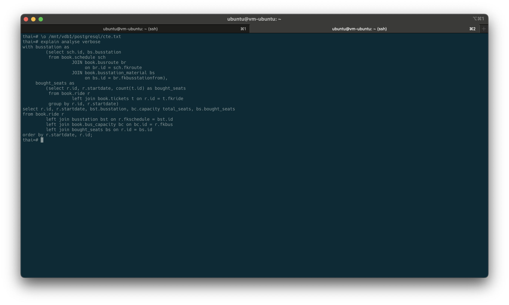

```sql
                                                                              QUERY PLAN                                                                              
----------------------------------------------------------------------------------------------------------------------------------------------------------------------
 Sort  (cost=1864791.83..1868541.83 rows=1500000 width=56) (actual time=361218.577..361445.206 rows=1500000 loops=1)
   Output: r.id, r.startdate, bs.busstation, bc.capacity, (count(t.id))
   Sort Key: r.startdate, r.id
   Sort Method: quicksort  Memory: 174543kB
   ->  Hash Left Join  (cost=1649080.34..1710917.85 rows=1500000 width=56) (actual time=358364.264..360147.607 rows=1500000 loops=1)
         Output: r.id, r.startdate, bs.busstation, bc.capacity, (count(t.id))
         Inner Unique: true
         Hash Cond: (r.fkbus = bc.id)
         ->  Hash Left Join  (cost=1649079.22..1703641.73 rows=1500000 width=52) (actual time=358364.223..359942.711 rows=1500000 loops=1)
               Output: r.id, r.startdate, r.fkbus, bs.busstation, (count(t.id))
               Hash Cond: (r.fkschedule = sch.id)
               ->  Hash Right Join  (cost=1649020.08..1682957.59 rows=1500000 width=24) (actual time=358363.239..359685.133 rows=1500000 loops=1)
                     Output: r.id, r.startdate, r.fkschedule, r.fkbus, (count(t.id))
                     Inner Unique: true
                     Hash Cond: (r_1.id = r.id)
                     ->  HashAggregate  (cost=1607161.08..1622161.08 rows=1500000 width=16) (actual time=357510.905..358000.880 rows=1500000 loops=1)
                           Output: r_1.id, r_1.startdate, count(t.id)
                           Group Key: r_1.id
                           Batches: 1  Memory Usage: 172049kB
                           ->  Hash Right Join  (cost=41859.00..1337175.64 rows=53997088 width=16) (actual time=520.717..335701.914 rows=53997475 loops=1)
                                 Output: r_1.id, r_1.startdate, t.id
                                 Inner Unique: true
                                 Hash Cond: (t.fkride = r_1.id)
                                 ->  Seq Scan on book.tickets t  (cost=0.00..1153573.88 rows=53997088 width=12) (actual time=0.017..308455.563 rows=53997475 loops=1)
                                       Output: t.id, t.fkride, t.fio, t.contact, t.fkseat
                                 ->  Hash  (cost=23109.00..23109.00 rows=1500000 width=8) (actual time=506.878..506.881 rows=1500000 loops=1)
                                       Output: r_1.id, r_1.startdate
                                       Buckets: 2097152  Batches: 1  Memory Usage: 74978kB
                                       ->  Seq Scan on book.ride r_1  (cost=0.00..23109.00 rows=1500000 width=8) (actual time=0.046..134.822 rows=1500000 loops=1)
                                             Output: r_1.id, r_1.startdate
                     ->  Hash  (cost=23109.00..23109.00 rows=1500000 width=16) (actual time=848.723..848.724 rows=1500000 loops=1)
                           Output: r.id, r.startdate, r.fkschedule, r.fkbus
                           Buckets: 2097152  Batches: 1  Memory Usage: 86697kB
                           ->  Seq Scan on book.ride r  (cost=0.00..23109.00 rows=1500000 width=16) (actual time=282.687..434.612 rows=1500000 loops=1)
                                 Output: r.id, r.startdate, r.fkschedule, r.fkbus
               ->  Hash  (cost=40.40..40.40 rows=1500 width=36) (actual time=0.947..0.952 rows=1500 loops=1)
                     Output: sch.id, bs.busstation
                     Buckets: 2048  Batches: 1  Memory Usage: 96kB
                     ->  Hash Join  (cost=3.58..40.40 rows=1500 width=36) (actual time=0.116..0.686 rows=1500 loops=1)
                           Output: sch.id, bs.busstation
                           Inner Unique: true
                           Hash Cond: (br.fkbusstationfrom = bs.id)
                           ->  Hash Join  (cost=2.35..33.57 rows=1500 width=8) (actual time=0.047..0.428 rows=1500 loops=1)
                                 Output: sch.id, br.fkbusstationfrom
                                 Inner Unique: true
                                 Hash Cond: (sch.fkroute = br.id)
                                 ->  Seq Scan on book.schedule sch  (cost=0.00..27.00 rows=1500 width=8) (actual time=0.005..0.125 rows=1500 loops=1)
                                       Output: sch.id, sch.fkroute, sch.starttime, sch.price, sch.validfrom, sch.validto
                                 ->  Hash  (cost=1.60..1.60 rows=60 width=8) (actual time=0.026..0.027 rows=60 loops=1)
                                       Output: br.id, br.fkbusstationfrom
                                       Buckets: 1024  Batches: 1  Memory Usage: 11kB
                                       ->  Seq Scan on book.busroute br  (cost=0.00..1.60 rows=60 width=8) (actual time=0.008..0.013 rows=60 loops=1)
                                             Output: br.id, br.fkbusstationfrom
                           ->  Hash  (cost=1.10..1.10 rows=10 width=36) (actual time=0.038..0.039 rows=10 loops=1)
                                 Output: bs.busstation, bs.id
                                 Buckets: 1024  Batches: 1  Memory Usage: 9kB
                                 ->  Seq Scan on book.busstation_material bs  (cost=0.00..1.10 rows=10 width=36) (actual time=0.026..0.027 rows=10 loops=1)
                                       Output: bs.busstation, bs.id
         ->  Hash  (cost=1.05..1.05 rows=5 width=12) (actual time=0.017..0.018 rows=5 loops=1)
               Output: bc.capacity, bc.id
               Buckets: 1024  Batches: 1  Memory Usage: 9kB
               ->  Seq Scan on book.bus_capacity bc  (cost=0.00..1.05 rows=5 width=12) (actual time=0.010..0.011 rows=5 loops=1)
                     Output: bc.capacity, bc.id
 Planning Time: 0.800 ms
 JIT:
   Functions: 57
   Options: Inlining true, Optimization true, Expressions true, Deforming true
   Timing: Generation 2.341 ms, Inlining 6.377 ms, Optimization 172.801 ms, Emission 103.682 ms, Total 285.200 ms
 Execution Time: 361563.588 ms
(69 rows)
```

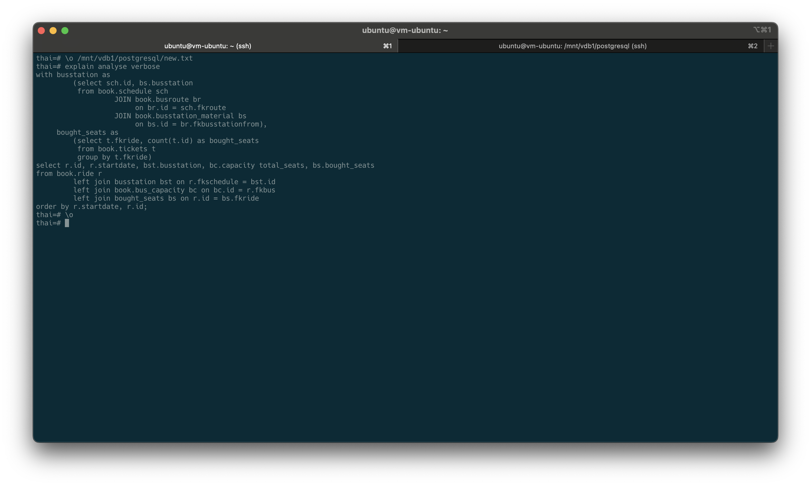

```postgresql
with busstation as
         (select sch.id, bs.busstation
          from book.schedule sch
                   JOIN book.busroute br
                        on br.id = sch.fkroute
                   JOIN book.busstation_material bs
                        on bs.id = br.fkbusstationfrom),
     bought_seats as
         (select t.fkride, count(t.id) as bought_seats
          from book.tickets t
          group by t.fkride)
select r.id, r.startdate, bst.busstation, bc.capacity total_seats, bs.bought_seats
from book.ride r
         left join busstation bst on r.fkschedule = bst.id
         left join book.bus_capacity bc on bc.id = r.fkbus
         left join bought_seats bs on r.id = bs.fkride
order by r.startdate, r.id;
```

```sql
                                                                                     QUERY PLAN                                                                                     
------------------------------------------------------------------------------------------------------------------------------------------------------------------------------------
 Sort  (cost=1551451.69..1555282.64 rows=1532381 width=42) (actual time=356346.874..356418.386 rows=1500000 loops=1)
   Output: r.id, r.startdate, bs_1.busstation, bc.capacity, bs.bought_seats
   Sort Key: r.startdate, r.id
   Sort Method: quicksort  Memory: 174543kB
   Buffers: shared hit=8156 read=613571
   ->  Hash Left Join  (cost=1339073.39..1394019.90 rows=1532381 width=42) (actual time=354610.901..355964.239 rows=1500000 loops=1)
         Output: r.id, r.startdate, bs_1.busstation, bc.capacity, bs.bought_seats
         Inner Unique: true
         Hash Cond: (r.id = bs.fkride)
         Buffers: shared hit=8156 read=613571
         ->  Hash Left Join  (cost=60.26..51069.26 rows=1500000 width=34) (actual time=306.519..986.974 rows=1500000 loops=1)
               Output: r.id, r.startdate, bs_1.busstation, bc.capacity
               Inner Unique: true
               Hash Cond: (r.fkbus = bc.id)
               Buffers: shared hit=8124
               ->  Hash Left Join  (cost=59.15..43793.15 rows=1500000 width=30) (actual time=306.497..740.391 rows=1500000 loops=1)
                     Output: r.id, r.startdate, r.fkbus, bs_1.busstation
                     Hash Cond: (r.fkschedule = sch.id)
                     Buffers: shared hit=8123
                     ->  Seq Scan on book.ride r  (cost=0.00..23109.00 rows=1500000 width=16) (actual time=0.024..125.196 rows=1500000 loops=1)
                           Output: r.id, r.startdate, r.fkbus, r.fkschedule
                           Buffers: shared hit=8109
                     ->  Hash  (cost=40.40..40.40 rows=1500 width=22) (actual time=306.454..306.461 rows=1500 loops=1)
                           Output: sch.id, bs_1.busstation
                           Buckets: 2048  Batches: 1  Memory Usage: 96kB
                           Buffers: shared hit=14
                           ->  Hash Join  (cost=3.58..40.40 rows=1500 width=22) (actual time=305.550..306.211 rows=1500 loops=1)
                                 Output: sch.id, bs_1.busstation
                                 Inner Unique: true
                                 Hash Cond: (br.fkbusstationfrom = bs_1.id)
                                 Buffers: shared hit=14
                                 ->  Hash Join  (cost=2.35..33.57 rows=1500 width=8) (actual time=0.055..0.481 rows=1500 loops=1)
                                       Output: sch.id, br.fkbusstationfrom
                                       Inner Unique: true
                                       Hash Cond: (sch.fkroute = br.id)
                                       Buffers: shared hit=13
                                       ->  Seq Scan on book.schedule sch  (cost=0.00..27.00 rows=1500 width=8) (actual time=0.016..0.170 rows=1500 loops=1)
                                             Output: sch.id, sch.fkroute, sch.starttime, sch.price, sch.validfrom, sch.validto
                                             Buffers: shared hit=12
                                       ->  Hash  (cost=1.60..1.60 rows=60 width=8) (actual time=0.024..0.027 rows=60 loops=1)
                                             Output: br.id, br.fkbusstationfrom
                                             Buckets: 1024  Batches: 1  Memory Usage: 11kB
                                             Buffers: shared hit=1
                                             ->  Seq Scan on book.busroute br  (cost=0.00..1.60 rows=60 width=8) (actual time=0.008..0.013 rows=60 loops=1)
                                                   Output: br.id, br.fkbusstationfrom
                                                   Buffers: shared hit=1
                                 ->  Hash  (cost=1.10..1.10 rows=10 width=22) (actual time=305.468..305.469 rows=10 loops=1)
                                       Output: bs_1.busstation, bs_1.id
                                       Buckets: 1024  Batches: 1  Memory Usage: 9kB
                                       Buffers: shared hit=1
                                       ->  Seq Scan on book.busstation_material bs_1  (cost=0.00..1.10 rows=10 width=22) (actual time=305.441..305.447 rows=10 loops=1)
                                             Output: bs_1.busstation, bs_1.id
                                             Buffers: shared hit=1
               ->  Hash  (cost=1.05..1.05 rows=5 width=12) (actual time=0.011..0.012 rows=5 loops=1)
                     Output: bc.capacity, bc.id
                     Buckets: 1024  Batches: 1  Memory Usage: 9kB
                     Buffers: shared hit=1
                     ->  Seq Scan on book.bus_capacity bc  (cost=0.00..1.05 rows=5 width=12) (actual time=0.006..0.007 rows=5 loops=1)
                           Output: bc.capacity, bc.id
                           Buffers: shared hit=1
         ->  Hash  (cost=1319858.36..1319858.36 rows=1532381 width=12) (actual time=354290.180..354290.288 rows=1500000 loops=1)
               Output: bs.bought_seats, bs.fkride
               Buckets: 2097152  Batches: 1  Memory Usage: 80838kB
               Buffers: shared hit=32 read=613571
               ->  Subquery Scan on bs  (cost=1289210.74..1319858.36 rows=1532381 width=12) (actual time=353394.133..353888.552 rows=1500000 loops=1)
                     Output: bs.bought_seats, bs.fkride
                     Buffers: shared hit=32 read=613571
                     ->  Finalize HashAggregate  (cost=1289210.74..1304534.55 rows=1532381 width=12) (actual time=353394.128..353757.469 rows=1500000 loops=1)
                           Output: t.fkride, count(t.id)
                           Group Key: t.fkride
                           Batches: 1  Memory Usage: 172049kB
                           Buffers: shared hit=32 read=613571
                           ->  Gather  (cost=952086.92..1273886.93 rows=3064762 width=12) (actual time=350315.178..351201.688 rows=4500000 loops=1)
                                 Output: t.fkride, (PARTIAL count(t.id))
                                 Workers Planned: 2
                                 Workers Launched: 2
                                 Buffers: shared hit=32 read=613571
                                 ->  Partial HashAggregate  (cost=951086.92..966410.73 rows=1532381 width=12) (actual time=350177.897..350676.764 rows=1500000 loops=3)
                                       Output: t.fkride, PARTIAL count(t.id)
                                       Group Key: t.fkride
                                       Batches: 1  Memory Usage: 221201kB
                                       Buffers: shared hit=32 read=613571
                                       Worker 0:  actual time=350117.723..350648.063 rows=1500000 loops=1
                                         Batches: 1  Memory Usage: 172049kB
                                         JIT:
                                           Functions: 7
                                           Options: Inlining true, Optimization true, Expressions true, Deforming true
                                           Timing: Generation 0.803 ms, Inlining 106.791 ms, Optimization 35.572 ms, Emission 22.028 ms, Total 165.193 ms
                                         Buffers: shared hit=16 read=204351
                                       Worker 1:  actual time=350101.124..350669.251 rows=1500000 loops=1
                                         Batches: 1  Memory Usage: 172049kB
                                         JIT:
                                           Functions: 7
                                           Options: Inlining true, Optimization true, Expressions true, Deforming true
                                           Timing: Generation 0.753 ms, Inlining 130.556 ms, Optimization 31.205 ms, Emission 15.566 ms, Total 178.081 ms
                                         Buffers: shared read=202987
                                       ->  Parallel Seq Scan on book.tickets t  (cost=0.00..838592.28 rows=22498928 width=12) (actual time=1.673..342889.491 rows=17999158 loops=3)
                                             Output: t.id, t.fkride, t.fio, t.contact, t.fkseat
                                             Buffers: shared hit=32 read=613571
                                             Worker 0:  actual time=1.204..342822.534 rows=17984370 loops=1
                                               Buffers: shared hit=16 read=204351
                                             Worker 1:  actual time=2.325..342948.935 rows=17863001 loops=1
                                               Buffers: shared read=202987
 Planning:
   Buffers: shared hit=67 read=9
 Planning Time: 7.716 ms
 JIT:
   Functions: 69
   Options: Inlining true, Optimization true, Expressions true, Deforming true
   Timing: Generation 3.779 ms, Inlining 246.892 ms, Optimization 250.312 ms, Emission 150.172 ms, Total 651.156 ms
 Execution Time: 356598.126 ms
(111 rows)
```

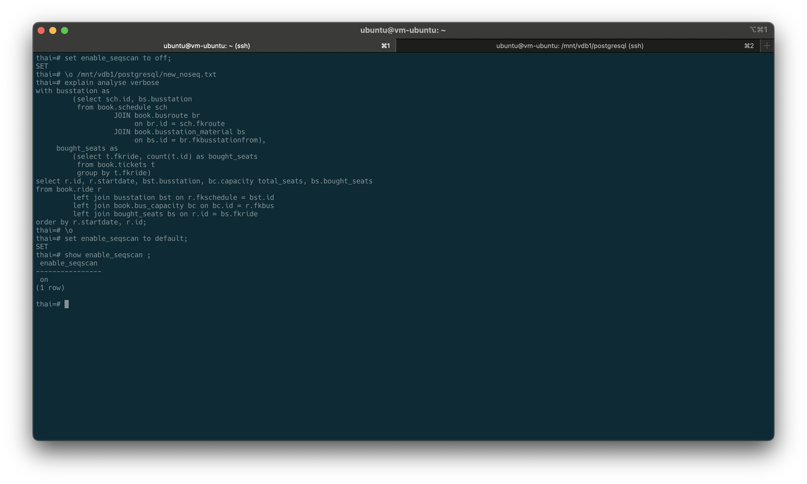

```sql
                                                                                       QUERY PLAN                                                                                        
-----------------------------------------------------------------------------------------------------------------------------------------------------------------------------------------
 Sort  (cost=25725462.44..25729293.39 rows=1532381 width=42) (actual time=648684.278..648756.949 rows=1500000 loops=1)
   Output: r.id, r.startdate, bs.busstation, bc.capacity, (count(t.id))
   Sort Key: r.startdate, r.id
   Sort Method: quicksort  Memory: 174543kB
   ->  Hash Left Join  (cost=80.96..25568030.64 rows=1532381 width=42) (actual time=293.313..647984.981 rows=1500000 loops=1)
         Output: r.id, r.startdate, bs.busstation, bc.capacity, (count(t.id))
         Hash Cond: (r.fkschedule = sch.id)
         ->  Merge Left Join  (cost=1.01..25546880.46 rows=1532381 width=28) (actual time=290.170..647370.909 rows=1500000 loops=1)
               Output: r.id, r.startdate, r.fkschedule, bc.capacity, (count(t.id))
               Inner Unique: true
               Merge Cond: (r.id = t.fkride)
               ->  Nested Loop Left Join  (cost=0.57..69637.72 rows=1500000 width=20) (actual time=254.117..1564.082 rows=1500000 loops=1)
                     Output: r.id, r.startdate, r.fkschedule, bc.capacity
                     Inner Unique: true
                     ->  Index Scan using ride_pkey on book.ride r  (cost=0.43..35137.13 rows=1500000 width=16) (actual time=4.131..527.716 rows=1500000 loops=1)
                           Output: r.id, r.startdate, r.fkbus, r.fkschedule
                     ->  Memoize  (cost=0.14..0.16 rows=1 width=12) (actual time=0.000..0.000 rows=1 loops=1500000)
                           Output: bc.capacity, bc.id
                           Cache Key: r.fkbus
                           Cache Mode: logical
                           Hits: 1499997  Misses: 3  Evictions: 0  Overflows: 0  Memory Usage: 1kB
                           ->  Index Scan using bus_capacity_id_idx on book.bus_capacity bc  (cost=0.13..0.15 rows=1 width=12) (actual time=0.013..0.013 rows=1 loops=3)
                                 Output: bc.capacity, bc.id
                                 Index Cond: (bc.id = r.fkbus)
               ->  GroupAggregate  (cost=0.44..25439014.17 rows=1532381 width=12) (actual time=36.038..645319.326 rows=1500000 loops=1)
                     Output: t.fkride, count(t.id)
                     Group Key: t.fkride
                     ->  Index Scan using tickets_fkride_idx on book.tickets t  (cost=0.44..25153703.22 rows=53997428 width=12) (actual time=1.217..640140.613 rows=53997475 loops=1)
                           Output: t.id, t.fkride, t.fio, t.contact, t.fkseat
         ->  Hash  (cost=61.20..61.20 rows=1500 width=22) (actual time=3.115..5.293 rows=1500 loops=1)
               Output: sch.id, bs.busstation
               Buckets: 2048  Batches: 1  Memory Usage: 96kB
               ->  Hash Join  (cost=9.08..61.20 rows=1500 width=22) (actual time=0.097..5.049 rows=1500 loops=1)
                     Output: sch.id, bs.busstation
                     Inner Unique: true
                     Hash Cond: (br.fkbusstationfrom = bs.id)
                     ->  Hash Join  (cost=5.37..51.88 rows=1500 width=8) (actual time=0.058..4.789 rows=1500 loops=1)
                           Output: sch.id, br.fkbusstationfrom
                           Inner Unique: true
                           Hash Cond: (sch.fkroute = br.id)
                           ->  Index Scan using schedule_pkey on book.schedule sch  (cost=0.28..42.58 rows=1500 width=8) (actual time=0.012..2.319 rows=1500 loops=1)
                                 Output: sch.id, sch.fkroute, sch.starttime, sch.price, sch.validfrom, sch.validto
                           ->  Hash  (cost=4.34..4.34 rows=60 width=8) (actual time=0.033..2.207 rows=60 loops=1)
                                 Output: br.id, br.fkbusstationfrom
                                 Buckets: 1024  Batches: 1  Memory Usage: 11kB
                                 ->  Index Scan using busroute_pkey on book.busroute br  (cost=0.14..4.34 rows=60 width=8) (actual time=0.010..0.021 rows=60 loops=1)
                                       Output: br.id, br.fkbusstationfrom
                     ->  Hash  (cost=3.58..3.58 rows=10 width=22) (actual time=0.025..0.026 rows=10 loops=1)
                           Output: bs.busstation, bs.id
                           Buckets: 1024  Batches: 1  Memory Usage: 9kB
                           ->  Index Scan using busstation_material_id_idx on book.busstation_material bs  (cost=0.14..3.58 rows=10 width=22) (actual time=0.013..0.017 rows=10 loops=1)
                                 Output: bs.busstation, bs.id
 Planning Time: 1.760 ms
 JIT:
   Functions: 44
   Options: Inlining true, Optimization true, Expressions true, Deforming true
   Timing: Generation 1.557 ms, Inlining 11.730 ms, Optimization 144.974 ms, Emission 93.333 ms, Total 251.594 ms
 Execution Time: 648849.849 ms
(58 rows)
```

Можно заметить, что самым "удачным" запросом получился второй, но в этом запросе самый "тяжелый" блок выполняется
350676.764ms, постараемся разобраться, в чем проблема.

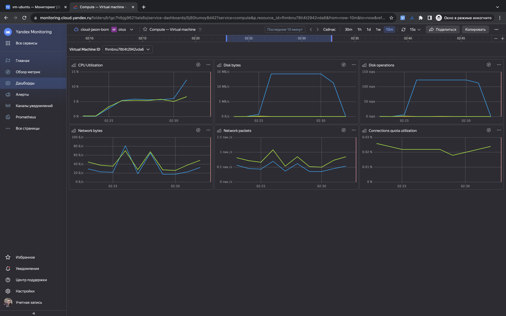

Судя по мониторингу, можно сделать вывод, что в момент запроса мы достигли лимита пропускной способности диска.

Итоговый запрос оказался быстрее изначального в 4.29 раз.
